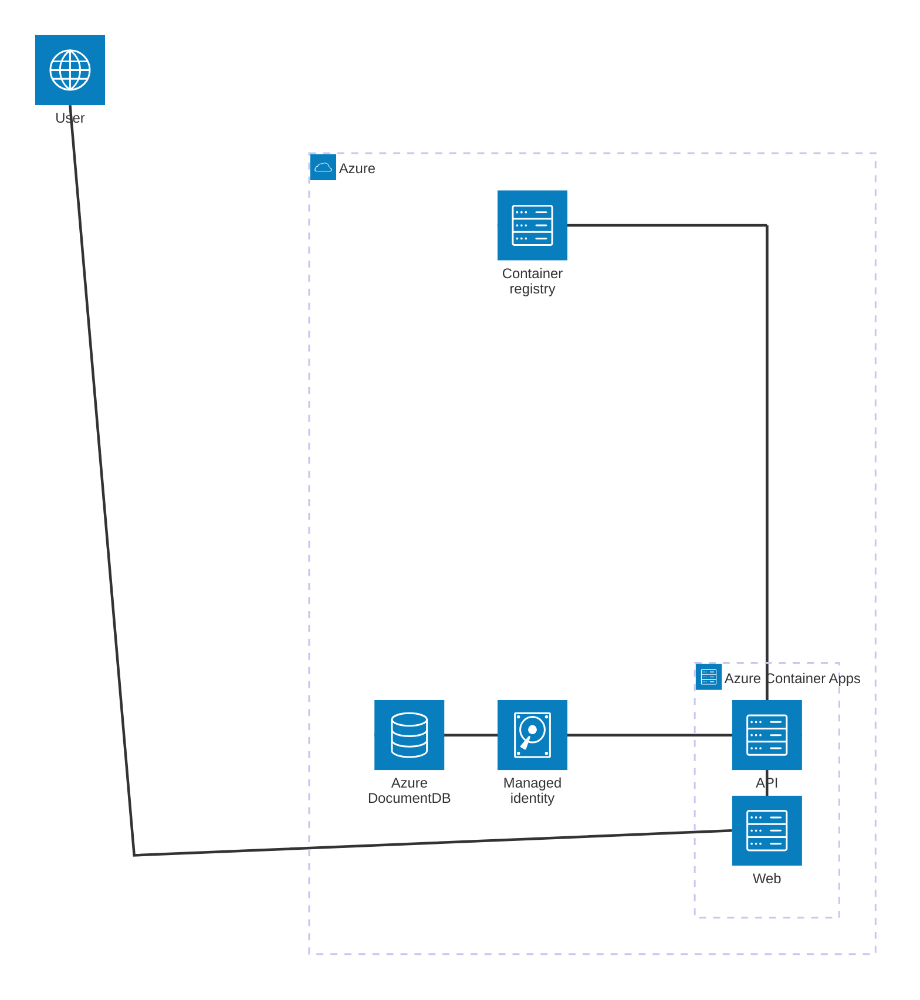
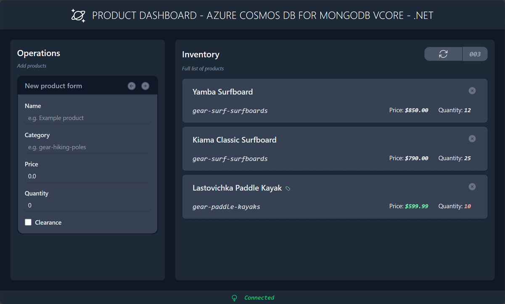

# Azure DocumentDB (with MongoDB compatibility) Quickstart - MongoDB driver for .NET

This Quickstart is a ASP.NET minimal API application that illustrates basic usage of the MongoDB driver for .NET with [Azure DocumentDB](https://learn.microsoft.com/azure/documentdb/). [Azure DocumentDB](https://learn.microsoft.com/azure/documentdb/) is built on [DocumentDB](https://github.com/documentdb) providing a powerful and flexible solution for NoSQL database needs.

## Pre-requisites

- [Docker](https://www.docker.com/)
- [Azure Developer CLI](https://aka.ms/azd-install)
- [.NET 9](https://dotnet.microsoft.com/download/dotnet/9.0)

## Deploy this solution

This solution is designed to be deployed to Azure with only a few commands. This template will deploy the following Azure service components:



1. Log in to Azure Developer CLI. *This is only required once per-install.*

    ```shell
    azd auth login
    ```

1. Initialize this template (`cosmos-db-mongodb-vcore-dotnet-quickstart`) using `azd init`.

    ```shell
    azd init --template cosmos-db-mongodb-vcore-dotnet-quickstart
    ```

1. Ensure that **Docker** is running in your environment.

1. Use `azd up` to provision your Azure infrastructure and deploy the web application to Azure.

    ```shell
    azd up
    ```

1. Observed the sample dashboard web application that targets your deployed REST API.

    

## (Optional) Run the solution locally

1. If you haven't deployed the solution already, provision the Azure infrastructure to deploy the Azure DocumentDB account with Microsoft Entra ID authentication enabled.

    ```shell
    azd provision
    ```

1. Navigate to the `src/api/` folder.

    ```shell
    cd ./src/api/
    ```

1. Check that your .NET user secrets are loaded correctly. The list should include:

    - `SETTINGS:ENDPOINT`
    - `SETTINGS:TENANTID`

    ```shell
    dotnet user-secrets list
    ```

    ```output
    SETTINGS:TENANTID = <microsoft-entra-tenant-id>
    SETTINGS:ENDPOINT = <azure-cosmos-db-mongodb-vcore-account-name>.global.mongocluster.cosmos.azure.com
    ```

1. Run the application.

    ```shell
    dotnet watch run
    ```

1. Test the local REST API with a few basic HTTP requests:

    - **Perform a health check (ping)**:

        ```http
        GET http://localhost:5454/status
        Accept: application/json
        ```

    - **Upsert a document into the collection**:

        ```http
        POST http://localhost:5454
        Content-Type: application/json

        {
          "id": "aaaaaaaa-0000-1111-2222-bbbbbbbbbbbb",
          "category": "gear-surf-surfboards",
          "name": "Yamba Surfboard",
          "quantity": 12,
          "price": 850.00,
          "clearance": false
        }
        ```

        ```http
        POST http://localhost:5454
        Content-Type: application/json

        {
          "id": "bbbbbbbb-1111-2222-3333-cccccccccccc",
          "category": "gear-surf-surfboards",
          "name": "Kiama Classic Surfboard",
          "quantity": 25,
          "price": 790.00,
          "clearance": false
        }
        ```

        ```http
        POST http://localhost:5454
        Content-Type: application/json

        {
          "id": "cccccccc-2222-3333-4444-dddddddddddd",
          "category": "gear-paddle-kayaks",
          "name": "Lastovichka Paddle Kayak",
          "quantity": 10,
          "price": 599.99,
          "clearance": true
        }
        ```

    - **Get a specific document from the collection**:

        ```http
        GET http://localhost:5454/bbbbbbbb-1111-2222-3333-cccccccccccc
        Accept: application/json
        ```

    - **Get all documents in the collection**:

        ```http
        GET http://localhost:5454
        Accept: application/json
        ```

    - **Get documents in the collection filtered by category**:

        ```http
        GET http://localhost:5454/category/gear-surf-surfboards
        Accept: application/json
        ```

        ```http
        GET http://localhost:5454/category/gear-paddle-kayaks
        Accept: application/json
        ```

    - **Delete a document from the collection**:

        ```http
        DELETE http://localhost:5454/cccccccc-2222-3333-4444-dddddddddddd
        ```
